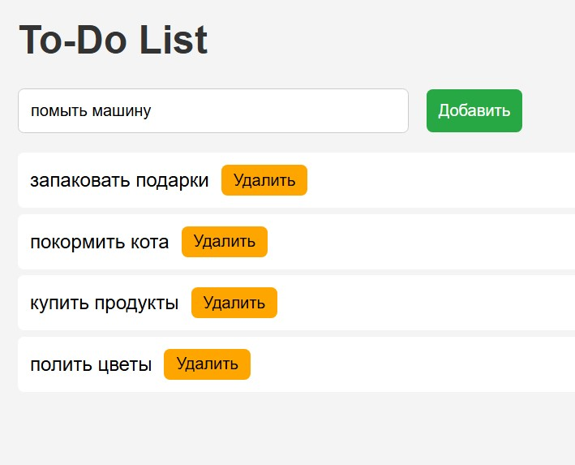

  <h1> Simple to-do planner/Простой планер</h1>
  
A simple to-do planner with the possibility to add tasks to the list, mark tasks as done(in this case the task will be crossed out) and remove tasks from the list.

Простой планер с возможностью добавлять задачи в лист, помечать задчи как выполненные и удалять задачи из списка

  <h2>Used technologies/С использованием:</h2> 
    

        
        
        
        
        
    

  <h2>Functionality/Возможности планнера:</h2>
  
Add new task/Добавить задачу в лист

  
Mark as done/Пометить как выполненную

  
Delete task/Удалить задачу

  
Save to local storage for 3 days/Хранение данных на 3 дня

  
  
  

